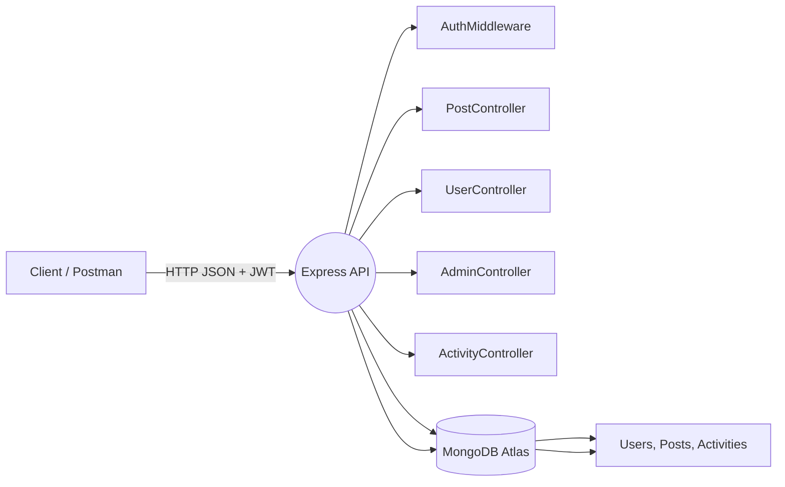

# 🚀 Social Activity Feed Backend
### Inkle Assignment — Backend Developer Role


A robust **Node.js + Express + MongoDB Atlas** backend implementing a social media feed with sophisticated **Role-Based Access Control (RBAC)**. The system handles users, posts, and social interactions while maintaining a global activity log.

---

## 🔗 Quick Links
- **📂 Repository:** [GitHub Link](https://github.com/Santhoshi2124/Inkle_Assignment_Backend)
- **🚀 Live Deployment:** [Render URL](https://inkle-assignment-backend.onrender.com)

---

## 🔎 Project Overview
This project is built to simulate a backend for a social platform where users can interact, and administrators can moderate content.

### 🎯 Assignment Goals
- **User Management:** Signup, Login, Profile Management.
- **Content:** Create, Read, Update, Soft-Delete posts.
- **Social Graph:** Follow/Unfollow, Like/Unlike, Block users.
- **Global Feed:** Centralized logging for all activities.
- **RBAC & Moderation:** - **User:** Standard interactions.
  - **Admin:** Can soft-delete any user/post.
  - **Owner:** Can promote/demote admins and manage the system.

---

## ✅ Implemented Features

### 🔐 Authentication & Security
- [x] **JWT Authentication:** Secure Register & Login flows.
- [x] **Password Hashing:** Uses `bcrypt` for security.
- [x] **RBAC Middleware:** Protects routes based on `User`, `Admin`, or `Owner` roles.

### 📝 Post & Feed Management
- [x] **CRUD Operations:** Full control over posts.
- [x] **Soft Delete:** Posts are marked `deleted: true` rather than removed from DB.
- [x] **Activity Logging:** Every action (Like, Follow, Post) is recorded in an `Activities` collection.

### 🤝 Social Interactions
- [x] **Follow System:** Users can follow/unfollow others.
- [x] **Like System:** Like/Unlike posts with duplicate prevention.
- [x] **Block Mechanism:** Blocking a user hides their feed and prevents interaction.

### 🛡️ Admin & Owner Powers
- [x] **Moderation:** Admins can delete offensive posts or users.
- [x] **Privilege Management:** Owner can promote users to Admin or demote them.

---

## 🛠️ Tech Stack

| Component | Technology |
| :--- | :--- |
| **Runtime** | Node.js (v16+) |
| **Framework** | Express.js |
| **Database** | MongoDB Atlas (Mongoose ODM) |
| **Auth** | JSON Web Tokens (JWT) |
| **Testing** | Postman / Thunder Client |
| **Deployment** | Render (Web Service) |

---

## 🏗️ Architecture

### Data Flow

---

## 📚 API Reference
**Base URL:** `/api`

### 🔐 Auth
| Method | Endpoint | Body | Description |
| :--- | :--- | :--- | :--- |
| **POST** | `/auth/register` | `{ name, email, password }` | Register new user (Returns Token) |
| **POST** | `/auth/login` | `{ email, password }` | Login user (Returns Token) |

### 👤 Users
| Method | Endpoint | Description | Access |
| :--- | :--- | :--- | :--- |
| **GET** | `/users/me` | Get current user profile | Auth |
| **GET** | `/users/:id` | Get specific user profile | Auth |
| **PUT** | `/users/me` | Update profile details | Auth |
| **GET** | `/users/me/feed` | Get personalized feed | Auth |
| **POST** | `/users/:id/follow` | Follow a user | Auth |
| **POST** | `/users/:id/unfollow` | Unfollow a user | Auth |
| **POST** | `/users/:id/block` | Block a user | Auth |

### 📝 Posts
| Method | Endpoint | Body | Description | Access |
| :--- | :--- | :--- | :--- | :--- |
| **POST** | `/posts` | `{ content }` | Create a new post | Auth |
| **GET** | `/posts/:postId` | N/A | Get single post details | Public/Auth |
| **PUT** | `/posts/:postId` | `{ content }` | Update post | Author Only |
| **DELETE** | `/posts/:postId` | N/A | Soft-delete post | Author/Admin |
| **POST** | `/posts/:postId/like` | N/A | Like a post | Auth |
| **POST** | `/posts/:postId/unlike` | N/A | Remove like | Auth |

### 📊 Activity & Feed
| Method | Endpoint | Description | Access |
| :--- | :--- | :--- | :--- |
| **GET** | `/activity/global` | Global activity feed (paginated) | Public |
| **GET** | `/activity/user/:id` | Specific user's activity log | Public |

### 🛡️ Admin & Owner
| Method | Endpoint | Description | Access |
| :--- | :--- | :--- | :--- |
| **POST** | `/admin/promote/:id` | Promote user to Admin | Owner Only |
| **POST** | `/admin/demote/:id` | Revoke Admin access | Owner Only |
| **DELETE** | `/admin/users/:id` | Soft-delete a user | Admin/Owner |

---

## 🧪 Testing Checklist (Thunder Client / Postman)

Use this checklist to verify the system works end-to-end.

### 1️⃣ Environment Setup
Create a new Environment in Postman/Thunder Client with these variables:
```json
{
  "baseUrl": "[https://inkle-assignment-backend.onrender.com](https://inkle-assignment-backend.onrender.com)",
  "token_owner": "",
  "token_A": "",
  "token_B": "",
  "userA_id": "",
  "userB_id": "",
  "post_id": ""
}
```

### 2️⃣ Execution Flow

**User Setup**
- [ ] **Register Owner, UserA, UserB:** Run `POST /auth/register` 3 times with different emails.
- [ ] **Save Tokens:** Update your environment variables with the `token` and `_id` received for each user.

**Content Creation**
- [ ] **Create Post (UserA):** `POST /posts` (Auth: `token_A`)
  - Body: `{ "content": "Hello World" }`
- [ ] **Save Post ID:** Update variable `post_id` from the response.
- [ ] **Get Post:** `GET /posts/{{post_id}}` → Verify it loads correctly.

**Social Graph**
- [ ] **Follow (UserB → UserA):** `POST /users/{{userA_id}}/follow` (Auth: `token_B`)
- [ ] **Like Post (UserB):** `POST /posts/{{post_id}}/like` (Auth: `token_B`)
- [ ] **Unlike Post:** `POST /posts/{{post_id}}/unlike` (Auth: `token_B`)

**Security Checks**
- [ ] **Update Post (Author):** `PUT /posts/{{post_id}}` (Auth: `token_A`) → *Status 200*
- [ ] **Update Post (Attacker):** `PUT /posts/{{post_id}}` (Auth: `token_B`) → *Status 403 (Forbidden)*
- [ ] **Block User:** `POST /users/{{userB_id}}/block` (Auth: `token_A`) → *Status 200*
- [ ] **Verify Block:** Try following UserA again using `token_B` → *Status 403*

**Admin Actions**
- [ ] **Promote UserB:** `POST /admin/promote/{{userB_id}}` (Auth: `token_owner`)
- [ ] **Admin Delete Post:** `DELETE /posts/{{post_id}}` (Auth: `token_B`) → *Status 200*
- [ ] **Admin Delete User:** `DELETE /admin/users/{{userA_id}}` (Auth: `token_B`) → *Status 200*
- [ ] **Owner Delete Admin:** `DELETE /admin/users/{{userB_id}}` (Auth: `token_owner`) → *Status 200*

### 3️⃣ Edge Case Validation
- [ ] **Empty Post:** Sending `{ "content": "" }` → *Status 400*
- [ ] **Double Like:** Liking a post twice → *Status 400 or Error message*
- [ ] **No Auth:** Accessing protected route without header → *Status 401*
- [ ] **No Auth:** Non-owner calling owner-only route → *Status 403*
